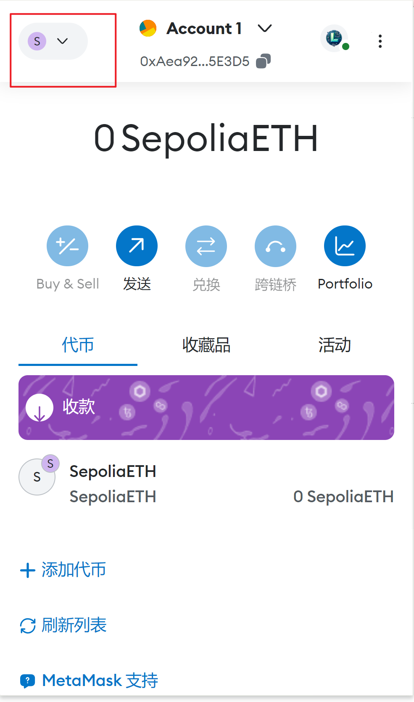
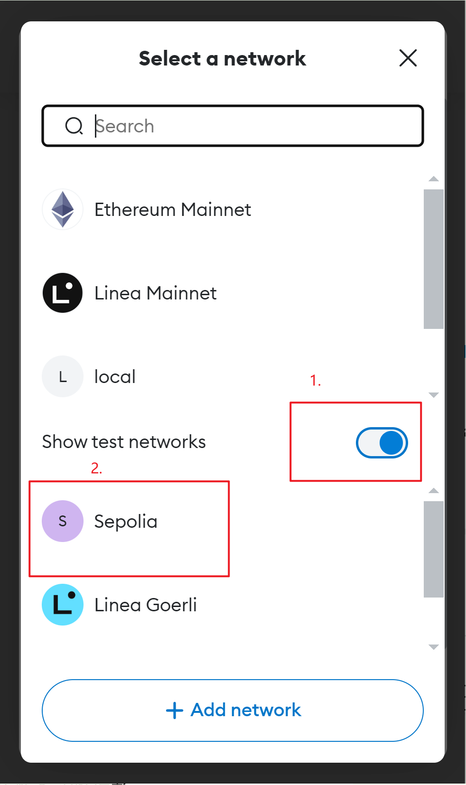
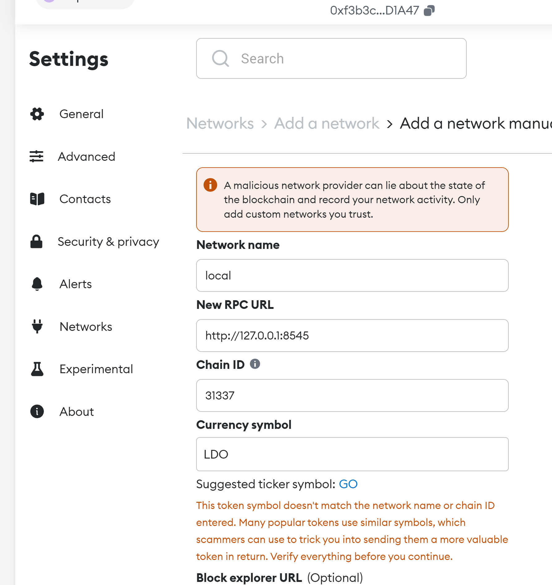

## 新手教程

这个代币提供了一种增加论坛活跃度的方法，用户可以在平台上发布对于某个帖子的评论任务，设置此次任务的 LDO 代币奖励，别的用户可以通过评论完成任务，领取 LDO 代币奖励

1. 在各大插件商店安装 meta mask，这个工具用于和区块链进行交互
2. 前往 https://sepolia-faucet.pk910.de/ 挖一些 sepolia 以太坊代币（只是模拟挖矿），用作交易 gas 费(因为只能使用 sepolia 以太坊作为 gas 费)
3. 在 meta mask 手动切换为测试网络 sepolia
  <div style="display: flex;">
  
  
  </div>


4. 手动导入 LDO 代币，点击 import tokens，输入合约地址：0x90b6Aa21eBC98D525fe6e6Ae2CA7089fCAD89857


5. 进入 LDO 网站 https://www.coinuxdo.me/ 连接钱包，开始使用（okx 钱包似乎有问题，建议 metamask）
6. 添加任务说明： description 填写帖子连接，reward 填写奖励，quantity 填写需要的评论数量（未测试），点击提交
7. 视频教程
   https://www.bilibili.com/video/BV1Yx421Q7tk
8. 这是一个[开源项目](https://github.com/14790897/ldo_coin)，前端为 next，数据库为 supabase，使用 hardhat 作为智能合约开发工具，部署在测试网 sepolia，未进行非法集资

## Quick start

The first things you need to do are cloning this repository and installing its
dependencies:

```sh
git clone https://github.com/NomicFoundation/hardhat-boilerplate.git
cd hardhat-boilerplate
npm install
```

Once installed, let's run Hardhat's testing network:

```sh
npx hardhat node
```

Then, on a new terminal, go to the repository's root folder and run this to
deploy your contract:

```sh
npx hardhat run scripts/deploy.js --network localhost
```

在 sepolia 测试网部署

```sh
npx hardhat run scripts/deploy.js --network sepolia
```

Finally, we can run the frontend with:

```sh
cd frontend
pnpm install
pnpm dev
```

Last but not least, you can gain some test token:

```sh
npx hardhat --network localhost faucet  <your-metamask-address>
```

Open [http://localhost:3000/](http://localhost:3000/) to see your Dapp. You will
need to have [Coinbase Wallet](https://www.coinbase.com/wallet) or [Metamask](https://metamask.io) installed and listening to
`localhost 8545`.

### meta mask 添加本地测试链

http://127.0.0.1:8545
链 ID: 31337


### 获得所有测试账户

#### 进入控制台

npx hardhat console

```sh
const accounts = await ethers.getSigners();
console.log("Accounts:", accounts.map(account => account.address));
```

## User Guide

You can find detailed instructions on using this repository and many tips in [its documentation](https://hardhat.org/tutorial).

- [Writing and compiling contracts](https://hardhat.org/tutorial/writing-and-compiling-contracts/)
- [Setting up the environment](https://hardhat.org/tutorial/setting-up-the-environment/)
- [Testing Contracts](https://hardhat.org/tutorial/testing-contracts/)
- [Setting up your wallet](https://hardhat.org/tutorial/boilerplate-project#how-to-use-it)
- [Hardhat's full documentation](https://hardhat.org/docs/)

For a complete introduction to Hardhat, refer to [this guide](https://hardhat.org/getting-started/#overview).

## What's Included?

This repository uses our recommended hardhat setup, by using our [`@nomicfoundation/hardhat-toolbox`](https://hardhat.org/hardhat-runner/plugins/nomicfoundation-hardhat-toolbox). When you use this plugin, you'll be able to:

- Deploy and interact with your contracts using [ethers.js](https://docs.ethers.io/v5/) and the [`hardhat-ethers`](https://hardhat.org/hardhat-runner/plugins/nomiclabs-hardhat-ethers) plugin.
- Test your contracts with [Mocha](https://mochajs.org/), [Chai](https://chaijs.com/) and our own [Hardhat Chai Matchers](https://hardhat.org/hardhat-chai-matchers) plugin.
- Interact with Hardhat Network with our [Hardhat Network Helpers](https://hardhat.org/hardhat-network-helpers).
- Verify the source code of your contracts with the [hardhat-etherscan](https://hardhat.org/hardhat-runner/plugins/nomiclabs-hardhat-etherscan) plugin.
- Get metrics on the gas used by your contracts with the [hardhat-gas-reporter](https://github.com/cgewecke/hardhat-gas-reporter) plugin.
- Measure your tests coverage with [solidity-coverage](https://github.com/sc-forks/solidity-coverage).

This project also includes [a sample frontend/Dapp](./frontend), which uses [Create React App](https://github.com/facebook/create-react-app).

## Troubleshooting

- `Invalid nonce` errors: if you are seeing this error on the `npx hardhat node`
  console, try resetting your Metamask account. This will reset the account's
  transaction history and also the nonce. Open Metamask, click on your account
  followed by `Settings > Advanced > Clear activity tab data`.

## Setting up your editor

[Hardhat for Visual Studio Code](https://hardhat.org/hardhat-vscode) is the official Hardhat extension that adds advanced support for Solidity to VSCode. If you use Visual Studio Code, give it a try!

## Getting help and updates

If you need help with this project, or with Hardhat in general, please read [this guide](https://hardhat.org/hardhat-runner/docs/guides/getting-help) to learn where and how to get it.

For the latest news about Hardhat, [follow us on Twitter](https://twitter.com/HardhatHQ), and don't forget to star [our GitHub repository](https://github.com/NomicFoundation/hardhat)!

**Happy _building_!**
